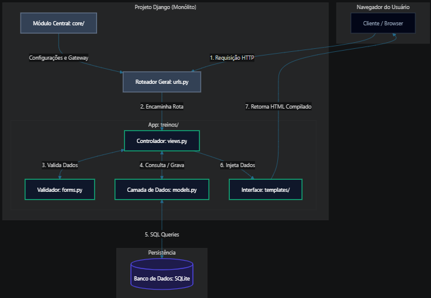

Trabalho prático de Programação Web - Arquitetura

Jhonata Evangelista da Conceição

Documentação da arquitetura do projeto final: FitTrack

Este documento descreve a estrutura arquitetural do projeto FitTrack, um sistema de gerenciamento de treinos e catalogação de exercícios desenvolvido para a disciplina de Programação Web.

1. Visão Geral

    O FitTrack utiliza o padrão de arquitetura MVT (Model-View-Template), que é a implementação nativa do 
framework Django para o ecossistema MVC (Model-View-Controller).

    O sistema opera sob o modelo de Monólito Modularizado, onde as responsabilidades de negócio, 
autenticação e persistência de dados estão contidas dentro do mesmo processo de execução, facilitando o deploy e o isolamento de componentes por meio de Apps Django (core e treinos).

2. Principais Componentes e Módulos
O sistema é dividido estruturalmente em camadas e aplicações isoladas que interagem entre si:

    * Módulo Central (core/)
    
    É o ponto de partida da aplicação. Não contém lógica de negócio direta, mas gerencia as configurações 
globais do sistema.

settings.py: Configurações de segurança, variáveis de ambiente, registro de aplicativos instalados, middlewares e conexões de banco de dados.

urls.py (Roteador Central): Atua como o Gateway de rotas da aplicação, interceptando as requisições HTTP do cliente e delegando o roteamento para os sub-aplicativos específicos (como o app treinos).

    * Módulo de Negócio (treinos/)
    
    Centraliza todo o escopo funcional do FitTrack (Cadastro de usuários, Autenticação, Catálogo de 
Exercícios e o Feed).

models.py (Camada de Dados): Define o Schema das tabelas do banco de dados utilizando a ORM do Django. 
Mapeia a entidade Exercicio e suas relações com o modelo padrão de usuários (User).

views.py (Camada de Controle): Contém os controladores lógicos do sistema. Processa requisições, interage com os Models para ler/gravar dados e injeta informações nos templates HTML.

forms.py (Validação): Estrutura e valida as requisições que chegam dos formulários, garantindo a integridade dos tipos de dados inseridos (ex: ExercicioForm e LoginForm).

urls.py (Rotas Internas): Mapeia os endpoints específicos da aplicação (Ex: /login/, /cadastrar-exercicio/, /editar/<id>/).

    * Camada de Visualização (templates/)
Contém as interfaces públicas renderizadas no lado do servidor (Server-Side Rendering).

index.html: O Dashboard unificado do usuário que exibe de forma reativa o Catálogo de Exercícios (Read do CRUD) e o Feed de notificações globais.

cadastrar_exercicio.html / editar.html: Interfaces de formulários de persistência de dados (Create/Update do CRUD).

confirmar_delecao.html: Interface de confirmação de segurança para expurgo de dados (Delete do CRUD).

3. Comunicação entre Componentes
  
    A comunicação do FitTrack baseia-se no ciclo padrão Requisição/Resposta HTTP assíncrona gerenciada 
pelo servidor:

-Requisição: O navegador do usuário solicita uma ação enviando uma requisição HTTP para o servidor Django.

-Roteamento: O core/urls.py recebe a requisição, identifica o padrão e a envia para a View correspondente em treinos/views.py.

-Processamento e Segurança: A View intercepta o pedido. Se a rota exigir autenticação, a camada verifica o estado da sessão em request.user.is_authenticated. Caso o usuário tente alterar dados, o método get_object_or_404(Exercicio, pk=pk, usuario=request.user) impede que dados de outros usuários sejam acessados.

-Persistência: A View aciona os métodos da ORM do Django (.save(), .delete()), mapeando os objetos Python para comandos SQL executados diretamente no SQLite.

-Renderização: A View injeta o resultado do banco de dados dentro do template HTML e o processa no servidor.

-Resposta: O Django retorna um arquivo HTML estático puro (com estilos Tailwind compilados) de volta ao navegador do cliente.

4. Tecnologias, Frameworks e Ferramentas

    O ecossistema de desenvolvimento do projeto é composto pelas seguintes tecnologias:

* Linguagens e Frameworks
Python (v3.12): Linguagem de programação principal utilizada no Back-End.

* Django Framework (v5.1): Framework web robusto utilizado para gerenciar o roteamento, a ORM, sessões de autenticação segura e renderização de templates.

* Front-End e Estilização
HTML5 / Django Template Language (DTL): Utilizado para estruturar as páginas e injetar lógica procedural (estruturas  e ) diretamente no HTML.

* Tailwind CSS (via CDN): Framework CSS utilitário para estilização responsiva e moderna da interface baseada em classes utilitárias, garantindo o visual no Modo Escuro (Dark Mode).

* Banco de Dados
SQLite3: Banco de dados relacional leve baseado em arquivo local, integrado nativamente ao Django e ideal para o escopo e isolamento do projeto em desenvolvimento.

* Ferramentas de Infraestrutura e Ferramental
Docker & Docker Compose: Utilizados para conteinerizar a aplicação. Garante que todo o ambiente (Python, pacotes e dependências) rode exatamente sob as mesmas condições industriais em qualquer sistema operacional.

* Git & GitHub: Ferramentas para controle de versionamento distribuído do código-fonte e gestão de Sprints de desenvolvimento.

